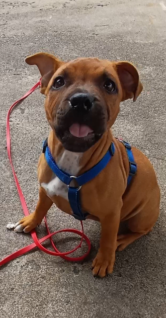

## Éducation canine à Saint-Etienne 

Ici tu trouveras une éducatrice canin & comportementaliste:  

- 🌿 Avec une approche **bienveillante et respectueuse** du chien
- 🐶 Qui met en place un suivi **personnalisé** pour chaque duo humain-chien
- 💚 Se passionne pour une **relation harmonieuse**  

  Pourquoi faire appel à moi?

<section class="cards">
  <article class="card">
    
    

      <h4>Éducation canine</h4>
      
Rééducation, étude du comportement, séances individuelles ou collectives, méthode positive basée sur l'encouragement.

      <a href="{{ '/services/' | relative_url }}">En savoir plus →</a>
    

  </article>

  <article class="card">
    
    

      <h4>Dogsitting</h4>
      
Gardes à domicile, balades individuelles ou collectives, centre aéré pour chiens.

      <a href="{{ '/services/' | relative_url }}">En savoir plus →</a>
    

  </article>

  <article class="card">
     <!-- corrigé: slash initial -->
    

      <h4>Programme PECCRAM</h4>
      
Programme d'éducation à la prévention des morsures pour enfants.

      <a href="{{ '/services/' | relative_url }}">En savoir plus →</a>
    

  </article>
</section>
