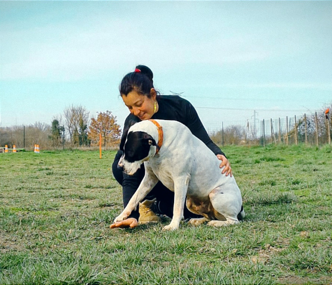
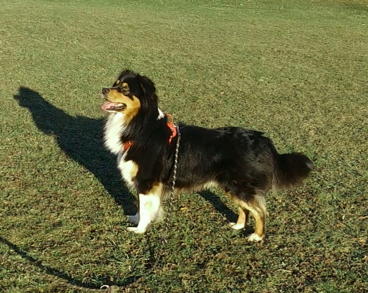
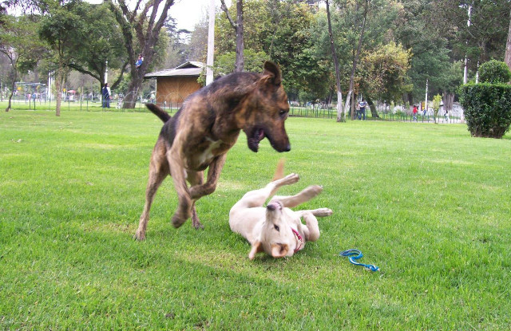

# Éducatrice canin et comportementaliste

Tu voudrais éduquer ton Bouledogue Français sans cris et sans contrainte&nbsp;? Ne plus te sentir dépassé-e par ton Malinois&nbsp;? Sortir sans stress avec ton border Collie ou ton Berger Allemand&nbsp;? Pouvoir faire confiance à ton Berger Australien&nbsp;? Apprendre les bases éducatives à ton Cocker chiot&nbsp;? Comprendre pourquoi ton Spitz aboie sans cesse&nbsp;?

J'accompagne tous types de chiens, avec une approche **d'éducation canine positive**, basée sur le respect du chien. Je t'aide à construire une relation plus sereine grâce à l'éducation, la rééducation et la compréhension du comportement.  
Chaque race de chien a ses besoins particuliers, stimulation mentale, physique, besoins d'attention, mais chaque chien est unique avec ses traits de caractères, son histoire, son développement. Je m'adapte à lui, à votre binôme et à tout le foyer familial.

Chien peureux, réactif, agressif, mordeur&nbsp;? Tu es au bon endroit, **je suis spécialisée dans l'accompagnement** de ces problématiques difficiles à vivre pour toi et ton chien.

**Secteur :** Saint-Étienne et alentours, Firminy, Roche-la-Molière, Villars, La Talaudière, Saint-Jean-Bonnefond, Planfoy...

  <a class="bouton-vert" href="{{ '/services/' | relative_url }}">Découvrir mon accompagnement</a>

## Des services adaptés à ton quotidien

- 🌿 Suivi personnalisé pour chaque duo humain–chien
- 🐶 Travail sur le rappel, la marche en laisse, la réactivité, la peur, les aboiements…
- 💚 Méthodes basées sur l'encouragement et la progression

<section class="cards">
  <article class="card">
    
    

      <h3>Éducation canine</h3>
      
Rééducation, comportement, séances individuelles ou collectives. Méthode positive basée sur l'encouragement.

      <a href="{{ '/services/#education-canine' | relative_url }}">Voir l'éducation canine →</a>
    

  </article>

  <article class="card">
    
    

      <h3>Dogsitting</h3>
      
Gardes à domicile, balades individuelles ou collectives, accueil centre aéré.

      <a href="{{ '/services/#dogsitting-promenade' | relative_url }}">Voir le dogsitting →</a>
    

  </article>

  <article class="card">
    
    

      <h3>Prévention morsure (PECCRAM)</h3>
      
Programme pour apprendre aux enfants à reconnaître le langage canin et éviter les accidents.

      <a href="{{ '/services/#prevention-des-morsures' | relative_url }}">Voir le PECCRAM →</a>
    

  </article>
</section>

Besoin d'un premier échange&nbsp;? <a href="tel:+33626490040">Appelle-moi au 06 26 49 00 40</a> ou <a href="mailto:canislupa@gmx.fr">écris-moi</a>.

  

