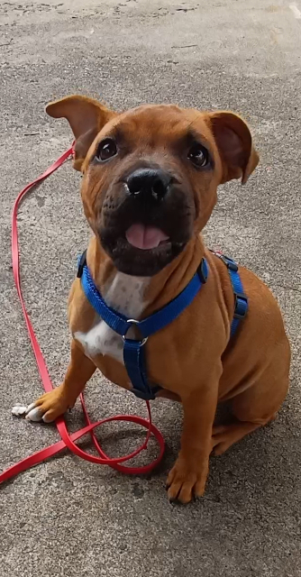

## Mes services

### Éducation canine

🐾 Éducation, rééducation, étude du comportement  
🐾 Séances individuelles et cours collectifs  
🐾 **Méthode positive basée sur l'encouragement**

<a class="bouton-vert" href="{{ '/educatrice-canin/' | relative_url }}">Comment se déroule un suivi éducatif et comportemental ?</a>

#### Le bilan comportemental

Premier RDV, obligatoire avant de commencer des séances d'éducation:

- Pour te connaitre, connaitre ton chien, et votre cadre de vie
- Comprendre vos besoins communs
- Proposer un plan de travail

🐾 Durée: environ 1H30  
🐾 Où: à ton domicile  

#### La séance d'éducation

Une séance peut-être donné seule ou dans le cadre d'un forfait, elle comprend:

- Un moment d'échange sur ce qui a évolué ou n'aurait pas été compris depuis notre dernier RDV, pour poser tes questions.
- Un moment où j'évalue l'intégration des exercices proposés précédemment et, éventuellement, les revoir ou les changer.
- Un moment où je te propose de nouveaux exercices et/ou un moment de décryptage de comportement

🐾 Durée: environ 1H  
🐾 Où: domicile, quartier, parc,... en fonction de ce qu'on a besoin de travailler

#### Le suivi premium

Pas à l'aise de travailler l'éducation seul-e entre chaque séance d'éducation?  
Tu peux opter pour un suivi premium:

- Un suivi quotidien si besoin
- Un accompagnement plus précis
- Une évolution plus rapide

🐾 Durée: environ 30 min  
🐾 Où: domicile, quartier, parc, ...

### Dogsitting

Ponctuel ou régulier, selon tes besoins, je peux m'adapter à tes demandes:

- Gardes à domicile
- Balades individuelles ou collectives
- Accueil type « centre aéré » pour chiens

🐾 Durée: de 30min à plusieurs heures  
🐾 Où: domicile, quartier, parc, forêt, ...

[Voir mes tarifs]({{ "/tarifs/" | relative_url }})

### Prévention morsure (PECCRAM)

**PECCRAM**  
Programme d'Éducation à la Connaissance du Chien et au Risque d'Accident par Morsure, créé par Chantal Hazard (FIMAC).

Les séances de PECCRAM ont pour objectifs de prévenir les accidents auprès des **enfants de 4 à 10 ans**, d'apprendre à reconnaître le langage canin et à se comporter face à un chien.  
Il peut y avoir jusqu'à 6 séances avec le même groupe d'enfants.

Déroulé d'une séance:

- Présentation du thème
- Activité en relation avec le thème pour intégrer une gestuelle
- Jeu de rôle

🐾 Durée: environ 1H  
🐾 Où: écoles, centres sociaux, périscolaire, ...

**Quelques chiffres :**

- 50% des enfants 3–5 ans confondent un chien stressé et joyeux
- Avec une éducation : seulement 17% d'erreurs
- 1/3 des morsures concernent des enfants de -10 ans
- Localisation fréquente : visage, crâne, coup

Vous trouvez aussi mes infos sur:  https://www.proxianimaux.fr 

[← Retour]({{ "/" | relative_url }})

