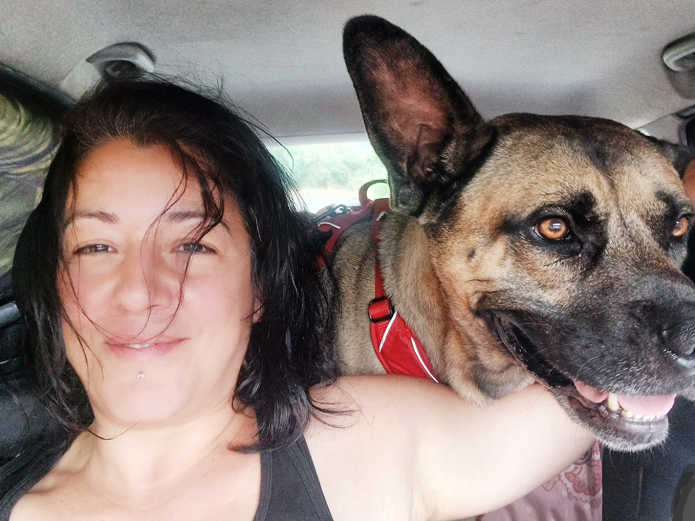

Parcours et formations de Canislupa, éducatrice canin à Saint-Étienne

## Salut !

Mary,    
Éducatrice canin & comportementaliste.

Je t'aide : 
- À retrouver un quotidien serein avec tes chiens : les gros, les micros, les babies, les papis, les chauds, les speed, les patapoufs...
- À améliorer la relation avec ton chien : qu'il soit plus calme, qu'il marche sans tirer, qu'il soit rassuré, qu'il cesse de mordiller ou qu'il reste auprès de toi en promenade.
- À comprendre ses besoins et à mettre en place des méthodes respectueuses, sans contrainte ni douleur. 

Si tu es prêt·e à évoluer avec lui, mon approche est basée sur la coopération et la bienveillance, pour que ton chien et toi puissiez progresser ensemble.

👉🏻 [Voir mon parcours]({{ "/quisuisje/" | relative_url }})

## Qui je suis

MARY  
Éducatrice canin & comportementaliste

> Je t'aide à retrouver un quotidien serein avec tes chiens : les gros, les micros, les babies, les papis, les chauds, les speed, les patapoufs...

Je peux t'aider si tu souhaites améliorer la relation avec ton chien : qu'il soit plus calme, qu'il marche sans tirer, qu'il soit rassuré, qu'il cesse de mordiller ou qu'il reste auprès de toi en promenade.

Je t'accompagne si tu es prêt·e à évoluer avec lui, à comprendre ses besoins et à mettre en place des méthodes respectueuses, sans contrainte ni douleur. Mon approche est basée sur la coopération et la bienveillance, pour que ton chien et toi puissiez progresser ensemble...

## Mes formations

**2025**
- Déclic et des chiens : Relax Max, chiens réactifs
- FIMAC CANIN : PECCRAM (prévention morsure)

**2024**
- ZOOPRO — ACACED
- Formations chiens réactifs/agressifs (ÉvolutionCanine, Cynrgie)
- MFEC — Éducation canine positive (certifiée)

**2023–2024**
- Nature de Chien : Éducation canine & étude du comportement

**2023**
- Déclics et des chiens : Activités de calme, marche en laisse

## Mon parcours

J'ai commencé le dogsitting avec Plume, l’Épagneule du voisin, au lycée.

Ensuite, j’ai gardé des chiens à domicile pendant des années.  
En 2006, j’ai adopté Maiitsoh, mon premier chien. J’ai dû tout apprendre et fait appel à un comportementaliste.

Puis j’ai été famille d’accueil pour des chiens, parfois pendant plusieurs mois.

La vieillesse de Maiitsoh m’a poussée à me former sur la santé du chien âgé. Sa perte m’a profondément marquée.

J’ai passé 3 ans sans chien mais toujours en dogsitting, avec un intérêt croissant pour le comportement canin.

En 2023, Tao est arrivé : Cane Corso x Malinois, traumatisé. Il m’a poussée à me former plus intensément.

> Tao est celui qui m’a fait autant douter que progresser dans ce métier.

[← Retour]({{ "/" | relative_url }})

