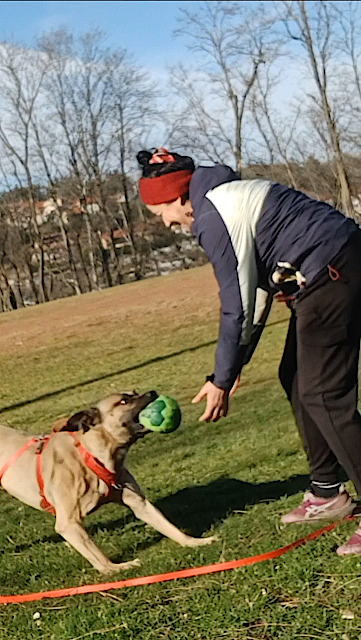

# Éducation canine et comportement du chien à Saint-Étienne

Faire appel à une **éducatrice canin** permet de mieux comprendre son chien, de prévenir ou corriger certains comportements et d'améliorer la vie quotidienne du duo humain–chien.

J'interviens à Saint-Étienne et alentours, **à domicile** et en extérieur, avec une approche basée sur le respect et l'encouragement.

## Quand faire appel à un éducateur canin&nbsp;?

Par exemple lorsque ton chien :

> Aboie de façon excessive
>
> Tire en laisse lors des promenades
>
> Avale tout ce qu'il trouve
>
> Saute sur les personnes
>
> Détruit des objets à la maison
>
> Fugue ou ne revient pas au rappel
>
> À peur des enfants, des congénères ou de son environnement
>
> Présente des comportements agressifs ou des réactions de morsure
>
> Vient d'être adopté et a besoin de repères

Tous ces comportements ont une cause : stress, peur, manque de repères, expériences passées, incompréhension...  
L'éducation canine ne consiste pas à "corriger" le chien, mais à l'aider à apprendre autrement.

## Une méthode d'éducation canine positive

Mon travail repose sur une **méthode positive**, sans violence ni contrainte.  
Je cherche à comprendre pourquoi ton chien agit comme il le fait, je t'aide à lire ses signaux de communication, puis je te propose des exercices adaptés.

👉 Je ne travaille jamais sans toi : tu participes aux séances pour pouvoir continuer sereinement au quotidien.

## Mise en place d'un suivi éducatif

Avant toute séance, un **bilan comportemental** est nécessaire.

### Le bilan comportemental

Ce premier rendez-vous dure environ 1h30 et se déroule à ton domicile.  
Il me permet de comprendre :

- ton chien (âge, histoire, environnement)
- votre quotidien
- tes attentes et difficultés

À l'issue du bilan, je te propose :

- un plan de travail personnalisé
- des séances adaptées si nécessaire
- les premiers conseils concrets à mettre en place

## Bases éducatives du chien

Un chien peut apprendre à tout âge.  
Les bases éducatives sont indispensables pour une vie commune équilibrée.

Elles permettent notamment :

- de comprendre les mécanismes d'apprentissage du chien
- de décrypter ses émotions
- de travailler la socialisation (humains, chiens, ville, bruits...)
- de clarifier ce que tu attends de lui

⚠️ Il ne s'agit pas de dressage, mais d'éducation et de compréhension mutuelle.

## Rééducation et troubles du comportement

Lorsque les apprentissages n'ont pas été faits correctement, ou suite à des expériences négatives (changements de vie, traumatismes, stress...), un chien peut développer des **troubles du comportement** :

- aboiements excessifs
- grattages et destructions
- malpropreté
- mordillements
- sauts, agitation ou inhibition

Dans ces situations, un travail de **rééducation** est nécessaire.  
Il demande souvent plus de séances, afin d'aider le chien à désapprendre certains comportements et à en construire de nouveaux.

## Chien peureux ou agressif

Un chien insuffisamment socialisé durant les premiers mois de sa vie, ou ayant subi des violences ou traumatismes, peut développer des réactions de peur ou d'agressivité.

Ces réactions peuvent se manifester par la fuite, le blocage, les grognements, les morsures.

Ces situations doivent être prises en charge avec beaucoup de précautions, dans le respect du chien et de la sécurité de tous.  
Un suivi plus long peut être nécessaire.

### Ma philosophie de travail

Quel que soit l'apprentissage à mettre en place, je n'utilise jamais la violence, les cris, la peur ou les méthodes punitives, car la sécurité et le bien-être passent avant tout.

Et pourtant, j'ai aidé de nombreux binômes Chien-Humain à vivre sereinement, à commencer par moi-même 😉  
Mon accompagnement s'appuie sur mon expérience de terrain et une formation continue en comportement canin.

## Mes recommandations   
### lectures, podcast, vidéos  
#### livres:  
- Chloé Fesch, <a href="https://www.rusticaeditions.com/9782815311038-le-petit-abc-rustica-de-l-education-positive-du-chiot-et-du-chien.html" target="_blank" rel="noopener noreferrer" title="Livre de Chloé Fesch pour éduquer son chiot" aria-label="Livre de Chloé Fesch pour éduquer son chiot (ouvre dans un nouvel onglet)">_Le petit abc Rustica de l'éducation positive du chiot et du chien_</a>  
- Charlotte Duranton, <a href="https://www.vox-animae.com/produit/le-comportement-de-mon-chien/" target="_blank" rel="noopener noreferrer" title="Livre de Charlotte Duranton" aria-label="Livre de Charlotte duranton (ouvre dans un nouvel onglet)">_Le comportement de mon chien_</a>  
- Alice Mignot, <a href="https://www.forum-saint-etienne.com/livre/9782322616596-dans-la-tete-des-chiens-ecoutez-ce-que-votre-chien-veut-vous-dire-alice-mignot/" target="_blank" rel="noopener noreferrer" title="Livre de Alice Mignot" aria-label="Livre de Alice Mignot (ouvre dans un nouvel onglet)">_Ecoutez ce que votre chien veut vous dire_</a>  

#### podcast/webinaires:  
- <a href="https://danslatetedeschiens.fr/podcast-2/" target="_blank" rel="noopener noreferrer" title="Podcast de Alice Mignot" aria-label="Podcast de Alice Mignot (ouvre dans un nouvel onglet)">Dans la tête des chiens</a>  
- <a href="https://podcast.ausha.co/madame-a-du-chien" target="_blank" rel="noopener noreferrer" title="Podcast de Madame a du chien" aria-label="Podcast Madame a du chien (ouvre dans un nouvel onglet)">Madame a du chien</a>  
- <a href="https://muzoplus.fr/webinaires/" target="_blank" rel="noopener noreferrer" title="Webinaires Muzoplus" aria-label="Webinaires Muzoplus (ouvre dans un nouvel onglet)">Webinaires du site Muzoplus

#### vidéos:  
- Documentaire, Turid Rugaas, _les signaux d'apaisement du chien_
- Tutos et conseils d'éducation, Pauline Debarbat, Déclic et des chiens (chaine Youtube)

#### FRIANDISES ET MASTICATION  
De mon côté, la grande majorité de ce que donne à mon chien vient de cette boutique en ligne:  
<a href="https://epicanin.com/" target="_blank" rel="noopener noreferrer" title="Epicanin friandises et mastication pour chiens" aria-label="Boutique Epicanin (ouvre dans un nouvel onglet)">_Boutique Epicanin_</a>  
Epicanin c’est 100% naturel, sans traitement chimique, sans additifs, sans colorants. Pour ne pas dénaturer les produits et pour conserver la qualité nutritive, toutes les friandises sont séchées à basse température.   
La fabrique se trouve dans le Jura, l'équipe est hyper réactive quand on a des question, j'adore!  

#### à Saint-Etienne  
- librairie Lune et L'autre  
- librairie Forum
- Maxizoo Steel et Firminy

#### Parcs et balades
- Parc de Montaud
- Parc Joseph Sanguedolce
- Jardin des plantes
- Parc de l'Europe
- Bois d'Avaize
- Gouffre d'enfer
- Voie verte de Saint-Etienne

  <a class="bouton-vert" href="{{ '/qui-suis-je/' | relative_url }}">En savoir plus sur moi</a>

---

[← Retour à l'accueil]({{ "/" | relative_url }})

