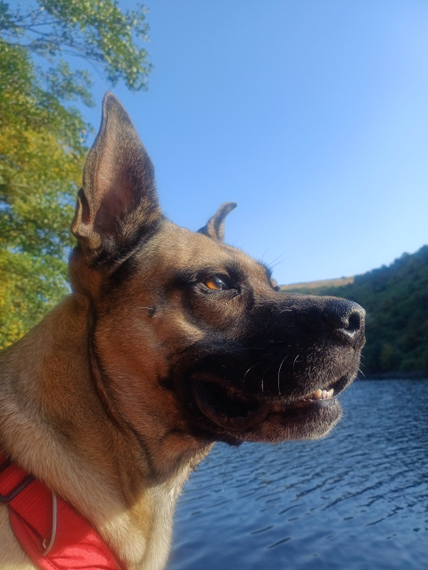

# Qui suis-je&nbsp;?

Je m'appelle Mary,  
je suis **éducatrice canine et comportementaliste à Saint-Étienne**.

J'aide les humains à retrouver un quotidien plus serein avec leurs **chiens** :  
les grands, les petits, **les chiots**, les papis, les émotifs, les énergiques, les sensibles et les patapoufs...
Mon objectif est de t'accompagner pour améliorer la relation avec ton chien :

- qu'il soit plus apaisé
- qu'il marche sans tirer
- qu'il se sente en sécurité
- qu'il cesse de mordiller
- qu'il reste attentif lors des promenades

Je t'accompagne si tu es prêt·e à évoluer avec lui, à comprendre ses besoins et à mettre en place des **méthodes respectueuses**, sans contrainte ni douleur.  
Mon approche repose sur la coopération, la bienveillance et la compréhension du chien, pour que vous puissiez progresser ensemble.

---

## Mes formations

Je me forme en continu afin d'actualiser mes connaissances et d'adapter ma pratique aux besoins des chiens et des humains.

### 2026

- Muzoplus : Webinaire _Le chien sourd_
- Jérémy Serindat : Stage Réactivité Chien–Humain (RCH) pour les chiens peureux et agressifs

### 2025

- Déclics et des chiens : _Relax Max_ (chiens réactifs : peurs, agressivité)
- FIMAC CANIN : PECCRAM (prévention des morsures)

### 2024

- ZOOPRO : ACACED
- Formations chiens réactifs / agressifs (Évolution Canine, Cynrgie)
- MFEC : Éducation canine positive (certifiée)

### 2023 / 2024

- Nature de Chien : <a href="https://www.naturedechien.fr" target="_blank" rel="noopener noreferrer" title="Centre de formation pour éducateur canin" aria-label="Centre de formation pour éducateur canin (ouvre dans un nouvel onglet)">Éducation canine et étude du comportement</a>

### 2023

- Déclics et des chiens : Activités de calme, marche en laisse

---

## Mon parcours

Mon histoire avec les chiens a commencé bien avant Canislupa.

J'ai débuté le dogsitting avec Plume, l'épagneule du voisin.  
Je la promenais en rentrant du lycée... ou parfois, c'était elle qui me promenait 😊

Ne voulant plus vivre sans chien, j'ai ensuite gardé de nombreux chiens à domicile pendant plusieurs années : promenades, soins, câlins, accompagnement au quotidien.

En 2006, j'ai adopté mon premier chien, Maiitsoh.  
Il avait 6 semaines, j'avais 28 ans, et j'ai dû tout apprendre pour lui.  
J'ai fait appel à un comportementaliste pour m'aider.  
Il a partagé 14 années de ma vie, à 100 %.

En parallèle, je suis devenue famille d'accueil, accueillant régulièrement des chiens pendant plusieurs mois.

La vieillesse de Maiitsoh m'a amenée à m'intéresser de près à la santé du chien senior.  
Sa perte m'a profondément marquée.

J'ai passé ensuite trois ans sans chien, tout en continuant le dogsitting et en approfondissant mon intérêt pour le comportement canin.

---

## Tao, le chien qui a tout changé

En 2023, Tao est entré dans ma vie.  
Cane Corso x Malinois, maltraité, puis passé plusieurs années en refuge.

Tao, c'est 40 kg de muscles... et énormément de peur.  
Il tire, charge, explose, réagit, agresse. Chaque sortie est un défi.

Tao a accéléré ma formation et ma compréhension de la **communication canine**.
Il est celui qui m'a fait autant douter que progresser dans mon métier d'éducatrice.

Grâce à lui, je sais ce que vous vivez lorsque vous avez un chien peureux, réactif ou agressif.  
Je connais :

- la fatigue
- les douleurs physiques quand il tire en laisse
- le stress des balades
- le découragement
- les questions difficiles que l'on se pose

> Est-il fait pour vivre avec moi&nbsp;?
>
> Est-ce que je le rends malheureux&nbsp;?
>
> Dois-je le donner&nbsp;?
>
> Que faire s'il mord&nbsp;?

### Et je sais comment améliorer cette situation.

Mon accompagnement s'appuie sur mon expérience de terrain, mon vécu personnel et une formation continue en **comportement et communication canine**, afin de vous aider à retrouver une relation plus sereine et sécurisée.

  <a class="bouton-vert" href="{{ '/tarifs/' | relative_url }}">Voir mes tarifs</a>

---

[← Retour à l'accueil]({{ "/" | relative_url }})
