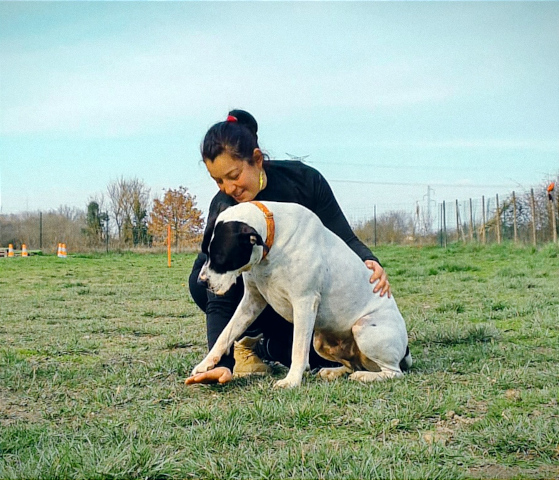

# **Mes services d'éducation canine, de dogsitting et de prévention des morsures**

J'accompagne les humains et leurs chiens à **Saint-Étienne** et alentours, **Firminy**, **Roche-la-Molière**, **Villars**, **La Talaudière**, **Saint-Jean-Bonnefond**, **Planfoy** et dans les communes voisines, pour améliorer le quotidien, prévenir les difficultés et construire une relation plus sereine.

Mes services s'adressent aussi bien aux **chiots** qu'aux **chiens adultes**, quels que soient leurs besoins, leur histoire ou leurs problématiques.

---

## **Éducation canine et comportement du chien** {#education-canine}

Je propose un accompagnement en **éducation canine positive**, basé sur la compréhension du chien, le respect de ses émotions et un suivi adapté à ton mode de vie.

🐾 Éducation et rééducation du chien  
🐾 Étude du comportement et accompagnement personnalisé  
🐾 Chien peureux, réactif, agressif, mordeur  
🐾 Séances individuelles et cours collectifs  
🾠Méthode basée sur l'encouragement et la coopération

  <a class="bouton-vert" href="{{ '/pourquoi-faire-appel/' | relative_url }}">Pourquoi faire appel ?</a>

### Le bilan comportemental du chien

Le **bilan comportemental** est le premier rendez-vous indispensable avant toute séance d'éducation.  
Il permet de poser des bases solides et adaptées à ton chien, à ton environnement et à ton quotidien.

Objectifs du bilan :

- apprendre à te connaître, toi, ton chien et votre cadre de vie
- comprendre vos besoins et vos difficultés
- définir un **plan de travail personnalisé**

🾠Durée : environ **1h30**  
🾠Lieu : **à ton domicile**

---

### La séance d'éducation canine

Les séances d'éducation peuvent être réalisées à l'unité ou dans le cadre d'un forfait.  
Chaque séance est adaptée à l'évolution de ton chien et à vos objectifs.

Une séance comprend :

- un temps d'échange pour répondre à tes questions
- l'évaluation des exercices précédemment proposés
- de nouveaux exercices et/ou un travail de décryptage du comportement

🾠Durée : environ **1h**  
🾠Lieu : domicile, quartier, parc... selon les besoins

---

### Le suivi premium

Si tu ne te sens pas à l'aise pour travailler seul·e entre les séances, le **suivi premium** permet un accompagnement renforcé et plus régulier.

Ce suivi inclut :

- un accompagnement plus fréquent, voire quotidien si nécessaire
- des ajustements précis en fonction de l'évolution
- une progression plus encadrée

🾠Durée : environ **30 minutes**  
🾠Lieu : domicile, quartier, parc...

  <a class="bouton-vert" href="{{ '/tarifs/#tarifs-education-canine' | relative_url }}">Voir mes tarifs éducation</a>

---

## **Dogsitting et promenades de chiens à Saint-Étienne** {#dogsitting-promenade}

Je propose également des prestations de **dogsitting et de promenades**, ponctuelles ou régulières, adaptées à ton organisation et aux besoins de ton chien.

Services proposés :

- garde à domicile
- balades individuelles ou collectives
- accueil centre aéré pour chiens

🾠Durée : de **30 minutes à plusieurs heures**  
🾠Lieu : domicile, quartier, parc, forêt...

  <a class="bouton-vert" href="{{ '/tarifs/#tarifs-dogsitting-et-promenades' | relative_url }}">Voir mes tarifs dogsitting</a>

---

## **Prévention des morsures, le Programme PECCRAM** {#prevention-des-morsures}

Le Programme d'Éducation à la Connaissance du Chien et au Risque d'Accident par Morsure (PECCRAM) créé par Chantal Hazard (FIMAC), vise à **prévenir les accidents par morsure**, notamment auprès des **enfants de 4 à 10 ans**, en leur apprenant à :

- reconnaître le langage canin
- adopter les bons comportements face à un chien

Les interventions peuvent comprendre jusqu'à **6 séances avec un même groupe**.

### Déroulé d'une séance PECCRAM

- présentation du thème
- activité pratique pour intégrer une gestuelle
- jeu de rôle

🾠Durée : environ **1h**  
🾠Lieu : écoles, centres sociaux, structures périscolaires...

**Quelques chiffres clés :**

- 50 % des enfants de 3 à 5 ans confondent un chien stressé et joyeux
- avec une éducation adaptée : seulement 17 % d'erreurs
- 1/3 des morsures concernent des enfants de moins de 10 ans
- zones les plus touchées : visage, crâne, cou

  <a class="bouton-vert" href="{{ '/tarifs/#tarifs-prevention-morsures' | relative_url }}">Voir mes tarifs PECCRAM</a>

---

### Pourquoi faire appel à Canislupa ?

- Approche respectueuse du chien
- Accompagnement personnalisé et progressif
- Interventions à domicile à **Saint-Étienne et alentours**
- Expérience en éducation, comportement et prévention

Tu peux également retrouver mes informations sur  
👉 [proxianimaux.fr](https://www.proxianimaux.fr/acteur/1570)

Besoin d'un premier échange ?  
👉 [Me contacter]({{ "/" | relative_url }})

---

[← Retour à l'accueil]({{ "/" | relative_url }})

